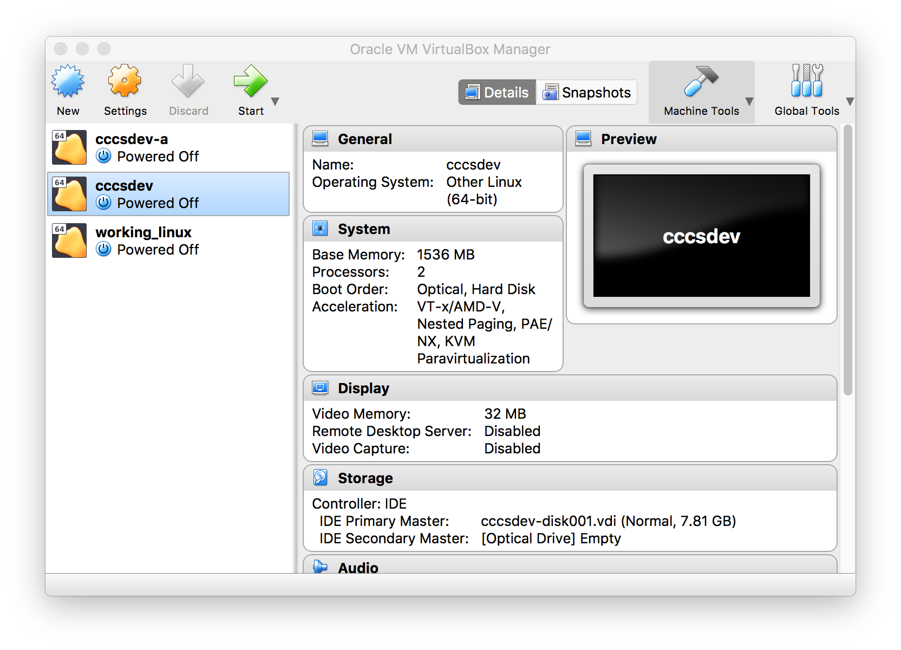
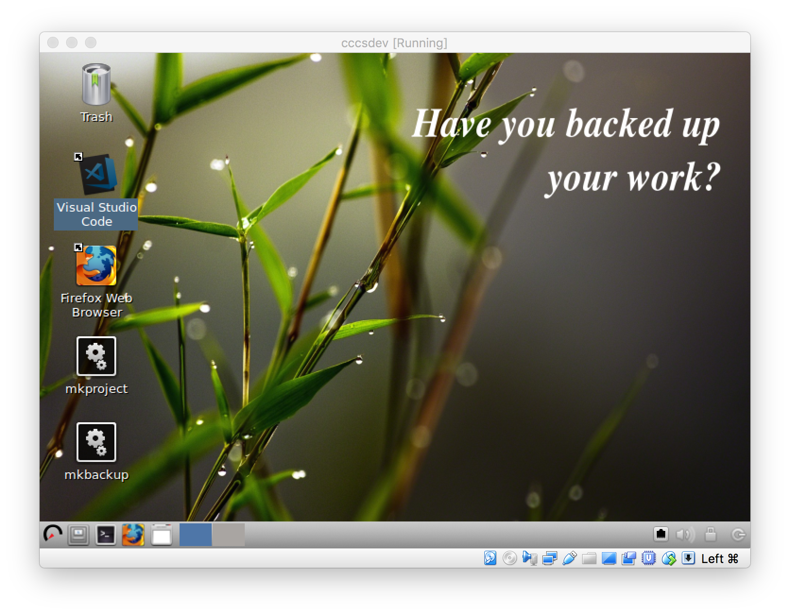
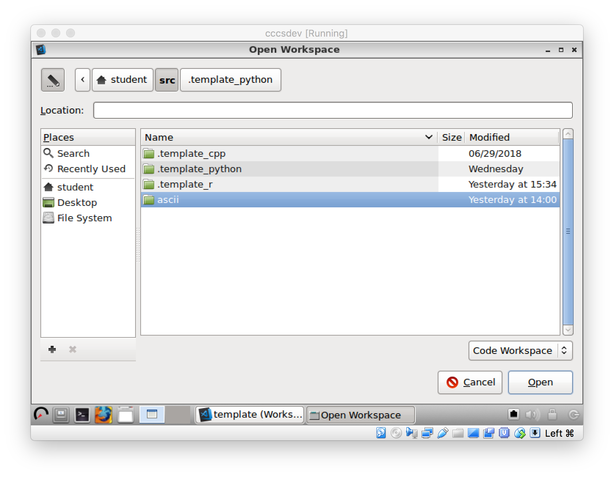
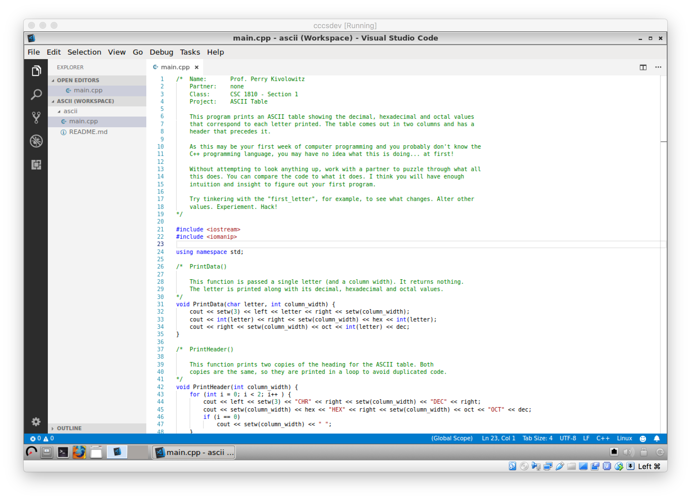
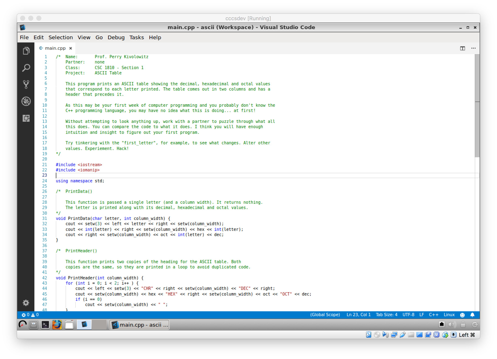

# Our development environment

The text below refers to using C++.

For a video covering the installation see [here](https://vimeo.com/280080837).

For a video covering using CCCSDev for C++, see [video not made yet]().

For a video covering using CCCSDev for Python, see [video not made yet]().

For a video covering using CCCSDev for R, see [video not make yet]().

After installing our development environment, start the VirtualBox (VB) Manager. Note your windows will differ slightly from the following:



You will have only one Virtual Machine (VM) named ```cccsdev``` for Carthage College Computer Science Development. Notice it says it is powered off. Double click on it - a old timey looking screen will come up, just hit the return key. Wait a bit and you'll see this:



Double click on ```Visual Studio Code```. All your programming work will be done in this program.

Use the File --> Open Workspace menu command shown here:


Navigate to ```ascii```. ASCII stands for American Standard Code for Information Interchange. Computers don't know about letters natively - only we do. ASCII is a code for mapping numbers to letters.



Don't go into any of the ```.template``` folders. There's nothing that interesting there. Really.

Double click on the workspace file. Each of your projects (that you'll create in the future) will have a workspace file with a name you pick prepended.


There's a good chance your next screen will be a welcome screen from VSCode. If it is, just close it by clicking on the ```x``` on the tab, not at the upper right of VSCode (that one will close the program). The icon in the dark area at left that looks like multiple pages can be clicked upon to view the files that make up your workspace. If ```main.cpp``` isn't already visible, double click on its name.


If you single click on a file name you are only peeking at it. You can tell when you're peeking at a file by noting that its name in the file tab is in itallics. Peeking at a file means that the tab will switch to another file (that you peek at). This is good for taking quick looks at files. The alternative to peeking is to double click on a file name. Then, its name in the tab will not be in itallics. This tab will remain open.

Note the bottom set of tabs. The one presently underlined says ```TERMINAL```. This is an integrated console. This is one of two places that compilation errors will be found. The preferred tab to view compilation problems is in the tab named ```PROBLEMS```. This entire set of tabs takes up a lot of screen space that you might want to use for editing. You can minimize this window with: ```^J```. This means hold the CONTROL key down at the same time as the J key.

All keyboard shortcuts inside CCCSDev are the same on Windows and Mac because you aren't using Mac or Windows inside the VM. You are using the VM which is the same on both host platforms.

Next is a picture of what VSCode looks like after hitting ```^J```:



Over on the left, if you click on the icon that looks like multiple pages again the left side bar will itself minimize. Here is what that looks like:




