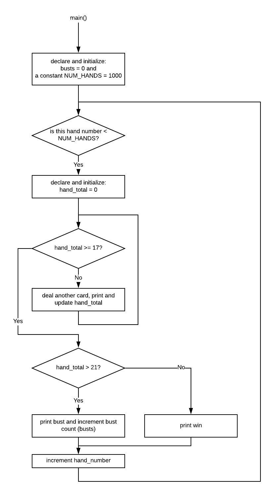

# Black Jack Simulation

## Overview

We are going to write a simulation of Black Jack - it will run *1000* times.

We will count the number of times we *bust* which means we accumulate more than 21.

## Rules

Here are the rules:

* Aces are counted as 11.
* Deuce through 10 are counted as themselves.
* Jack through King are counted as 10.
* A single simulation ends if either:
	* an accumulated score exceeds 21 (bust)
	* an accumulated score is between 17 and 21 (win)

## Output

For each simulation (game), output a line with the accumlated score and terminate with either *bust* or *win*.

```
Sim: 0 - 4 9 19 win
Sim: 1 - 10 2 22 bust
.
.
.
Of 1000 simulations there were 999 busts.
````

## Random numbers

Remember to see the random number generator using ```srand()```.

```c++
#include <ctime>

	// In main near its beginning.
	srand((unsigned int) time(nullptr));
```

Then calling ```rand()``` returns an integer between 0 and ```RAND_MAX```.

But, we need random numbers between 0 and 12 where 0 will be an Ace - Computer Science always starts counting from 0. Unless you're Microsoft. Then you start counting from 1 sometimes. But mostly 0. Sigh.

| random number | count as | card |
| ------------- | -------- | ---- |
| 0 | 11 | Ace |
| 1 | 2 | 2 |
| 2 | 3 | 3 |
| 3 | 4 | 4 |
| 4 | 5 | 5 |
| 5 | 6 | 6 |
| 6 | 7 | 7 |
| 7 | 8 | 8 |
| 8 | 9 | 9 |
| 9 | 10 | 10 |
| 10 | 10 | Jack |
| 11 | 10 | Queen |
| 12 | 10 | King |

Notice that random numbers 1 through 9 are counted as that number plus 1.

Notice that random numbers 10 through 12 are counted as 10.

Noticing these makes your code much simpler.

## So what do you need?

You need an algorithm!

How about this:



It looks like there is a loop within a loop.

The outer loop counts through the number of full hands (the number of simulations). This should go from 0 to ```NUM_HANDS```. This smells like a ```for``` loop.

The inner loop deals out the cards in one hand. This one smells like a ```while``` loop since we don't know beforehand how many cards will be dealt in one hand.

## Have Fun!

Really. Have fun!

# Link to Markdown Documentation

This is a markdown document. markdown is an easy way to make nice looking
documentation of your work. Here is a [link](https://github.com/adam-p/markdown-here/wiki/Markdown-Cheatsheet) to markdown syntax.

