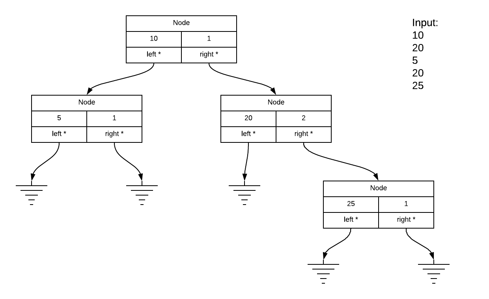

# Binary Tree Class Exercise

This code nearly completely implements a sorted binary tree. The infix enumerator is left out.

A binary tree will look like this:

In the diagram above, the ground symbols are used to represent null pointers.

