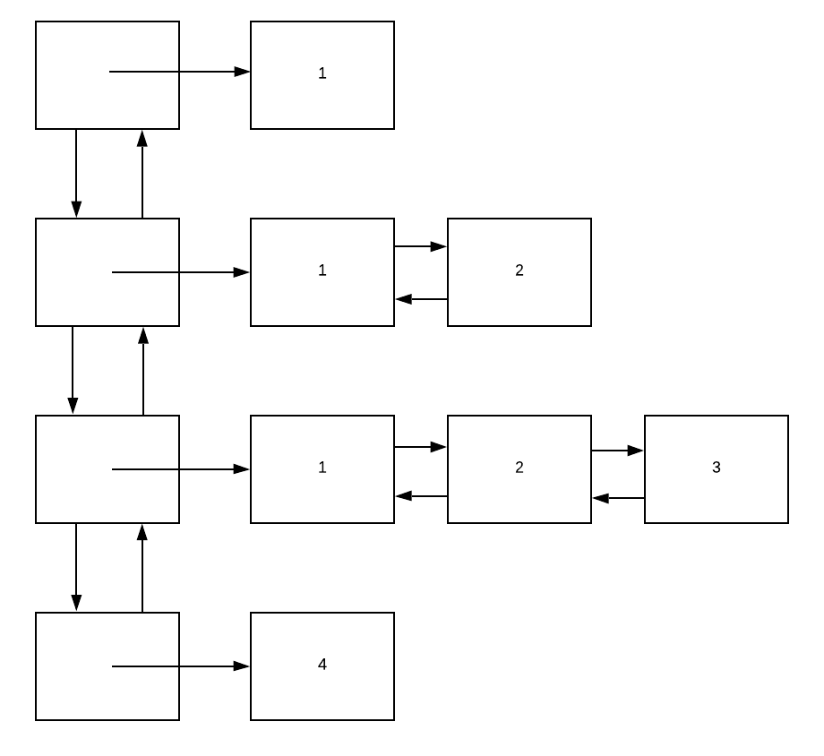

# List of lists

In the project you will get a wee bit of practice using the ```list``` container, allocating and deleting dynamic memory and use valgrind for the first time.

# The input

## Specifying the input file

Your input will be located in a file which you will specify on the command line like this:

```
> ./a.out filename
```

If you do not specify the filename, you must do the following:

```
> ./a.out
Must provide name of input file.
```

If you specify a filename that cannot be opened, you must do the following:

```
> ./a.out BADFILENAME
Unable able to open BADFILENAME
```

## Format of the input

Each line is either blank (in which case it must be skipped by your program), or it will contain one or more integers separated by spaces.

For example:
```
1
1 2
1 2 3

4
```

# Your output

Given the above input, you must produce the following output (verbatim):

```
> ./a.out t1.txt 
List counter: 4
Size of outer list: 4
List 1 has 1 elements and sums to 1
List 2 has 2 elements and sums to 3
List 3 has 3 elements and sums to 6
List 4 has 1 elements and sums to 4
```

The input was located in a file called ```t1.txt```. 

| Text | Meaning |
| ---- | ------- |
| List counter: 4 | This counts the number of lists you created accumulated as you created them. |
| Size of outer list: 4 | After finishing with the input, this is the size() of your outer list. It should agree with the previous line. |
| List 1 has 1 elements and sums to 1 | This was produced by having a 1 on a line by itself. |
| List 2 has 2 elements and sums to 3 | This output is due to "1 2" |
| List 3 has 3 elements and sums to 6 | This output is due to "1 2 3" |
| List 4 has 1 elements and sums to 4 | This output is due to "4" |

# The data structure

You are going to build a list of dynamically allocated lists of integers. The outer list is defined in this way:

```c++
list<list<int> *> outer_list;
```

So, ```outer_list``` is a list containing pointers to lists of integers.

With each new line, you are to dynamically allocate a list L of integers. Then, for every integer on the line, push the integer onto the back of L. When you have completed a line, push L onto the back of ```outer_list```.

The structure will look like this:



# Required parts

The required parts of your code include (but are not necessarily limited to):

- checking argc for the "right" value

- getting the filename from ```argv[0]```, opening the file and checking that it opened properly

- reading the input from filename, skipping blank lines and creating lists of integers found on each line. The lists must be dynamically created

- closing the input file

- printing out the size / line checks and ensuring they agree

- printing the number of elements in each list and printing their sum

- properly freeing the dynamically allocated memory

# Return value of the program

If there is an error, return 1. If the program runs correctly, return 0. Check your return values like this:

```
> ./a.out
Must provide name of input file.
> echo $?
1
```

In this case, the error (of no filename) was signalled by the error message as well as the return of 1.

# valgrind

Valgrind is a program that runs your program and looks for any leaked memory. Leaked memory will happen when memory is dynamically allocated but not deleted. A certain amount of memory seems to be leaked by C++ programs. Here is what the correct output looks like:

```
> valgrind ./a.out t1.txt 
==6807== Memcheck, a memory error detector
==6807== Copyright (C) 2002-2015, and GNU GPL'd, by Julian Seward et al.
==6807== Using Valgrind-3.11.0 and LibVEX; rerun with -h for copyright info
==6807== Command: ./a.out t1.txt
==6807== 
List counter: 4
Size of outer list: 4
List 1 has 1 elements and sums to 1
List 2 has 2 elements and sums to 3
List 3 has 3 elements and sums to 6
List 4 has 1 elements and sums to 4
==6807== 
==6807== HEAP SUMMARY:
==6807==     in use at exit: 72,704 bytes in 1 blocks
==6807==   total heap usage: 19 allocs, 18 frees, 82,832 bytes allocated
==6807== 
==6807== LEAK SUMMARY:
==6807==    definitely lost: 0 bytes in 0 blocks
==6807==    indirectly lost: 0 bytes in 0 blocks
==6807==      possibly lost: 0 bytes in 0 blocks
==6807==    still reachable: 72,704 bytes in 1 blocks
==6807==         suppressed: 0 bytes in 0 blocks
==6807== Rerun with --leak-check=full to see details of leaked memory
==6807== 
==6807== For counts of detected and suppressed errors, rerun with: -v
==6807== ERROR SUMMARY: 0 errors from 0 contexts (suppressed: 0 from 0)
```

In the above, you see the output of the program in the middle of valgrind's output. You see the 72,704 bytes leaked by the C++ runtime library. This is not your problem.

Here is the same program with the code that deletes the dynamically allocated memory itself deleted:

```
> valgrind ./a.out t1.txt 
==6887== Memcheck, a memory error detector
==6887== Copyright (C) 2002-2015, and GNU GPL'd, by Julian Seward et al.
==6887== Using Valgrind-3.11.0 and LibVEX; rerun with -h for copyright info
==6887== Command: ./a.out t1.txt
==6887== 
List counter: 4
Size of outer list: 4
List 1 has 1 elements and sums to 1
List 2 has 2 elements and sums to 3
List 3 has 3 elements and sums to 6
List 4 has 1 elements and sums to 4
==6887== 
==6887== HEAP SUMMARY:
==6887==     in use at exit: 72,968 bytes in 12 blocks
==6887==   total heap usage: 19 allocs, 7 frees, 82,832 bytes allocated
==6887== 
==6887== LEAK SUMMARY:
==6887==    definitely lost: 96 bytes in 4 blocks
==6887==    indirectly lost: 168 bytes in 7 blocks
==6887==      possibly lost: 0 bytes in 0 blocks
==6887==    still reachable: 72,704 bytes in 1 blocks
==6887==         suppressed: 0 bytes in 0 blocks
==6887== Rerun with --leak-check=full to see details of leaked memory
==6887== 
==6887== For counts of detected and suppressed errors, rerun with: -v
==6887== ERROR SUMMARY: 0 errors from 0 contexts (suppressed: 0 from 0)
```

# Partner rules

This project allows you to partner with at most one person. That is, you may do the work yourself or with another.

If you work with another person, you must both submit something *different*.

One partner must submit the project's source code - the source code must specify the names of both partners.

The other partner must submit a TEXT FILE that contains the name of the partner who is submitting the actual project.

# Assigned / Due

This project is assigned Monday, February 18. It is due at the end of Monday, February 25th.


