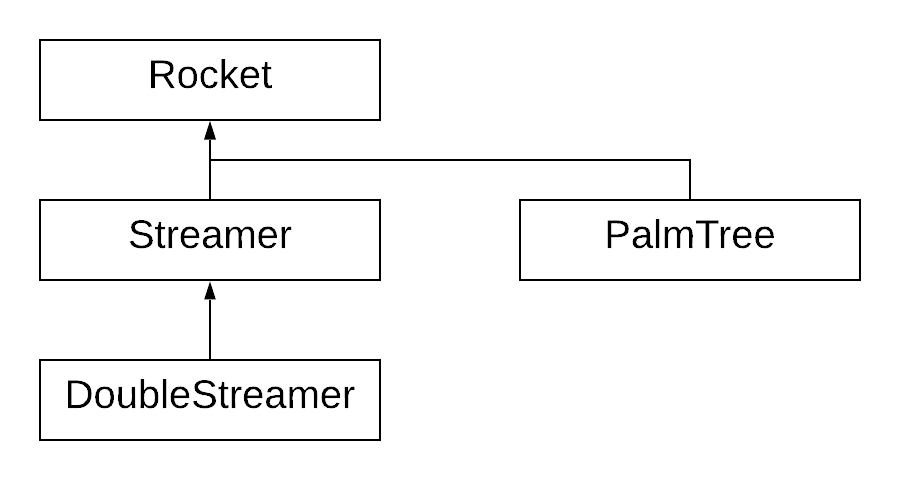

# Retro Fireworks

C++ is an example of an object oriented programming language which provides a behavior called *polymorphism*. Polymorphism is when more than one function or method with the same name can be called to produce different results.

You have seen a kind of polymorphism in the past when you have overloaded functions or operators. This is *static polymorphism*. This is known as *early binding* because the choice of which implementation to use is made at compile time.

Another type of polymorphism works in conjunction with *inheritance*. When one class inherits from another the *subclass* becomes a specialization of the *base class*.

Given:

```c++
class Base {
public:
	Base();
	int foo;
};

class Subclass : public Base {
public:
	Subclass();
	int bar;
}
```

one can say that Subclass **is a** Base that has what Base has plus an integer named ```bar```. That **is a** is the distinguishing characteristic of derived or subclasses.

# Curses

In this project you will use the curses library. The curses library is called from your code and linked to your object code by the linker. If you are using a project made from my script, there is nothing you need do for the link step.

A minimal curses program that initializes curses then takes it down is:

```c++
#include <curses>

int main()
{
	initscr();
	endwin();
	return 0;
}
```

This program will compile and link with curses and when run, appears to do nothing. 

A critical thing to understand about curses is that it uses *double buffering*. Double buffering (even quad buffering) is heavily used in computer graphics whereby two logical screens are used, the front screen and the back screen. While the front screen is being displayed, drawing takes place in the back screen. When the back screen is complete, it is swapped for the front screen. Then, the former front screen is used as the current back screen and is used for drawing. 

The back screen is used to accumulate what will be shown to the user *next*.

Curses was created at a time when users using dial-up modems received only about 30 to 120 characters per second. Given that a terminal provided 80 columns by 24 rows (1920 characters) receiving 30 per second meant a full screen would take 64 seconds to update!

The curses package was created to finely optimize (reduce) the number of characters that needed to be transmitted. It did this by accumulating the *next* screen in a back buffer and then comparing it to the front screen. Only the differences were transmitted.

Many classic (now considered retro) user interfaces were created using curses. Curses even supported windows!

Due to double buffering, no screen changes take place until you called the ```refresh()``` function. Here is a program that clears the screen, draws a border then waits for 5 seconds before exiting.

```c++
#include <curses.h>
#include <thread>
#include <chrono>

int main()
{
	initscr();
	erase();
	box(stdscr, 0, 0);
	refresh();
	std::this_thread::sleep_for(std::chrono::seconds(5));
	endwin();
	return 0;
}
```

If the ```refresh()``` were left out, the program would appear to do nothing. Run the above program from the command line having compiled it thusly (assumes the code is in main.cpp).

```
g++ main.cpp -lcurses
```

```initscr()``` initializes the internal state of curses and creates a standard "screen" called ```stdscr```.

After ```initscr()``` has been called, two integer variables defined by curses become valid. These are ```LINES``` and ```COLS```. These tell you how big the standard screen is.

The following program puts ```hello world``` centered on the screen.

```c++
#include <curses.h>
#include <thread>
#include <string>
#include <chrono>

using namespace std;

int main()
{
        initscr();
        erase();
        box(stdscr, 0, 0);

        string hw("hello world");
        mvaddstr(LINES / 2, (COLS - hw.size()) / 2, hw.c_str());

        refresh();
        std::this_thread::sleep_for(std::chrono::seconds(5));
        endwin();
        return 0;
}
```

The function ```mvaddstr()``` is a combination of ```move()``` and ```addstr()```. Notice is takes the y coordinate first, then x. That is, it takes the line number first then the column number.

Lines are numbered from 0 (being the topmost screen line). Columns are also numbered from 0 (being the leftmost column).

Here is a link to a tutorial on curses:

[NCURSES Programming HOWTO](http://www.tldp.org/HOWTO/NCURSES-Programming-HOWTO/)

Here is another tutorial - more complete:

[Writing programs with curses](https://invisible-island.net/ncurses/ncurses-intro.html)

Here is a complete curses manual:

[curses manual](https://invisible-island.net/ncurses/man/ncurses.3x.html)

# This project - retro fireworks

In this project you will create a base class called ```Rocket``` which knows how to fly and draw a simple rocket. Then, you will define a fixed set of defined subclasses that specialize ```Rocket``` to create different behaviors.

## The classes

Then, you will create subclasses of ```Rocket``` which draw more interesting fireworks. The *is a* relationship is readily apparent. A ```Streamer``` is a ```Rocket``` that exploded with a circular pattern.

Here is the Rocket class (you must use it verbatim):

```c++
class Rocket
{
  public:
	Rocket();
	virtual ~Rocket();

	void SetImpulse(float x, float y);
	void SetTriggerAge(int i);
	void SetAgeLimit(int i);
	void SetPosition(Rocket &other);
	void SetForce(float x, float y);
	virtual void Draw();
	virtual void Step();

	int GetAge();
	bool IsAlive();
	bool IsTriggered();

	static void SetGravity(float g);
	static void SetLogFile(std::ofstream *log_file);
	static void SetVector(std::vector<Rocket *> *);

	virtual void Trigger();

  protected:
	int age;
	int age_limit;
	int trigger_age;

	// Nameless structs - see specification
	struct
	{
		float x, y;
	} position;

	struct
	{
		float x, y;
	} force;

	static float gravity;
	static std::ofstream *log_file;
	static std::vector<Rocket *> *rockets;
};
```

There are a number of interesting things in this class. Notice the comment about *nameless structs*? This is a way of grouping together related members in a convenient and easy fashion. Example:

```c++
Rocket r;
r.force.x = 0.0;
r.position.y = 22.0;
```

There are some data members marked ```static```. This means that for all instances of ```Rocket``` there are only one of these variables. All instances share them.

A static data member is declared in the class but space has to be reserved for them in your code. In a code file called, for example, ```rocket.cpp``` the following lines must appear in the global scope.

```
float Rocket::gravity = -1.0;
ofstream *Rocket::log_file = nullptr;
vector<Rocket *> *Rocket::rockets = nullptr;
```

Notice there are *setter* methods for giving non-default values to the static data members. These methods are also marked ```static``` though technically, there is no requirement of this.

The ```virtual``` methods provide for the specialized characteristics of the subclasses you will write.

See below for a specification of the various methods you have to write.

After writing the base class (and completely testing it), you will write several specializations. Here are two:

```c++
class Streamer : public Rocket
{
  public:
	~Streamer();
	void Draw();

	static std::vector<std::pair<float, float>> v1;
	virtual void Trigger();
};

class DoubleStreamer : public Streamer
{
  public:
	virtual void Trigger();
};
```

Here, ```Streamer``` is a specialization of ```Rocket``` and ```DoubleStreamer``` is a specialization of ```Streamer```. Other types of fireworks also derive from ```Rocket``` like so:



Notice the arrows flow upward towards the base class.

## Learning a little more about Class Access Modifiers

You have seen ```public``` and ```private```. These are access modifiers. There are in fact three access modifiers:

| name | meaning |
| ---- | ------- |
| public | Members and methods marked public are accessible by all code in the program. |
|protected | Members and methods marked protected are accessible only by the class itself and any subclasses |
|private | Members and methods marked private are only accessible by the class itself. |

When inheriting from a base class, there are also access modifiers as in here:

```c++
class Streamer : public Rocket
```

This usage determines how to treat members and methods from the base class. 

| name | meaning |
| ---- | ------- |
| public | The access modifiers of members and methods of the base class are preserved. |
|protected | Public members in the base class are treated as protected members of the derived class. |
|private | Public and protected members of the base class are treated as private. |

The following is taken from [here](https://stackoverflow.com/questions/860339/difference-between-private-public-and-protected-inheritance).

```c++
class A 
{
public:
    int x;
protected:
    int y;
private:
    int z;
};

class B : public A
{
    // x is public
    // y is protected
    // z is not accessible from B
};

class C : protected A
{
    // x is protected
    // y is protected
    // z is not accessible from C
};

class D : private A    // 'private' is default for classes
{
    // x is private
    // y is private
    // z is not accessible from D
};
```

## More detailed ```Rocket``` specification

Methods:

| Method | Parameters | Comment |
| ------ | ---------- | ------- |
| Constructor | n/a | Initialize data memebers. |
| Destructor | n/a | Does not need to do anything. |
| SetTriggerAge | age | The trigger age is the number of steps before something changes - for example, a rocket explodes to produce a custom distribution of new particles. |
| SetAgeLimit | age | After *age* number of steps, the particle is eliminated. This is how particles are removed from the system. |
| SetPosition | x, y | Set the initial position of a rocket. Typically y is zero. x ranges between zero and COLS |
| SetPosition | Rocket & | Set the initial position of a rocket from the current position of another rocket - useful in ```Trigger()``` |
| SetForce | x, y | Sets the force of a rocket. For an initial value, typically x might range between -0.5 and 0.5. Typically y might range between 3.5 and 4.5. |
| Draw | n/a | Draws the rocket at its current location |
| Step | n/a | Applies the current value of force to update the current position. The current force is then mediated by gravity |
| Trigger | n/a | Called to cause a change in the rocket. For example, blossom into a palm tree |
| GetAge | n/a | Returns the current age of the rocket. ```Step()``` increments age by one |
| IsAlive | n/a | Returns true if the age of the rocket is less than the age limit set for the rocket |
| IsTriggered | n/a | returns true if the age of the rocket is greater than or equal to the trigger age |
| SetGravity | g | **STATIC** method sets the float value g to be gravity. Gravity is a negative number added to the y component of the rocket's force during each ```Step()```. The reference implementation uses a gravity of -0.2 |
| SetLogFile | ofstream * | **STATIC method*** is for you for debugging purposes. Once you enable curses, you cannot print to the screen any more. Use this feature if you want a means of seeing debugging output |
| SetVector | vector<Rocket *> * | **STATIC method** Rockets may spawn other rockets when triggered. The argument gives your Rocket class access to the vector of Rockets you maintain in your main loop |

Data members:

| Member | Comment |
| ------ | ------- |
| age | Initially zero, age is incremented every time ```Step()``` is called |
| age_limit | The age at which the rocket should be removed from the vector of rockets |
| trigger_age | The age at which the rocket should be triggered |
| position | The rocket's current coordinates - see *About coordinates* |
| force | the rocket's current force. This value is applied to position during each ```Step()``` and then reduced by gravity |

# About coordinates

For the purposes of computation, assume that the ground is at y equals 0. However, for drawing, line zero is the top of the screen. When drawing, simply invert the y coordinate of the rocket with something like:

```c++
LINES - position.y```
```

# Required specializations (derived classes)

## Palm tree

```c++
class PalmTree : public Rocket
{
  public:
	~PalmTree();

	static std::vector<std::pair<float, float>> v1;
	virtual void Trigger();
};
```

A Palm Tree rocket spawns 8 ```Sparklers``` in a horizontal arrangement when triggered.

The *static* ```vector``` of float pairs is used to store the force offsets to be applied to each of the 8 spawned ```Sparklers```. The force should be left or right and up a little.

The spawning is implemented by ```Trigger()```.

The Palm Tree inherits the ```Draw()``` method from ```Rocket```.

## Sparkler

```c++
class Sparkler : public Rocket
{
  public:
	void Draw();
};
```

The ```Sparkler``` ```Draw()``` alternates the rendering of the rocket between '+' and 'x' based on age.

## Streamer

```c++
class Streamer : public Rocket
{
  public:
	~Streamer();
	void Draw();

	static std::vector<std::pair<float, float>> v1;
	virtual void Trigger();
};
```

The ```Streamer``` spawns 8 ```Sparklers``` in a circular pattern. The square root of two is your friend. Initialize the *static* ```vector``` v1 with the forces to be applied. 

```Trigger()``` causes the spawning to take place.

## DoubleStreamer

```c++
class DoubleStreamer : public Streamer
{
  public:
	virtual void Trigger();
};
```

The ```DoubleStreamer``` inherits from ```Streamer```. It differs only in how many ```Sparklers``` are spawned (and with what force). The ```DoubleStreamer``` spawns eight more ```Sparklers``` than ```Streamer``` in the same directions but with half as much force. Think about this paragraph and the next requirement. What does this mean?

**There is a special requirement in DoubleStreamer:**

The ```DoubleStreamer``` ```Trigger()``` **must not** duplicate the work of the ```Trigger()``` in ```Streamer```. Instead, it must leverage the work that can be done by its *superclass*. Notice there is not vector of forces in ```DoubleStreamer```. A ```DoubleStreamer``` can use the same vector as defined in ```Streamer```.

## Initializing the force vectors

Recalling that the force vectors described above are **static**, you might be wondering how to initialize them. Hint - they must be initialized only once. Where you do that is up to you. Ask yourself, how can you know if a vector has already been initialized? The answer is plain.

## Setting the initial up force (argc / argv)

Use a default up force of 4 +/- 0.5. If ```argc``` is greater than one, attempt to convert it to a float and use it as the initial up force. Being able to adjust the up force is needed to allow for console windows that are tall or not. An up force that is too large will launch rockets above the top of the window. No fun in that. 

# Exiting the program

The program must run until you quit it by typing CNTRL-c. That is, hold the CONTROL key and the 'c' key at the same time.

# Use of dynamic memory allocation

Notice the use of pointers to class instances. You must not leak memory. This program *doesn't end* so using ```valgrind``` isn't an option but I will be inspecting your code for proper use of ```delete```. Whenever a rocket ages out, it should be deleted (and removed from the vector of rockets - see next).

# Problems iterating over the vector of rockets

Your main loop will iterate over the existing rockets. But, more rockets may be added while you're doing this (because of age-related triggering). You must not iterate over the new rockets.

Also, when you cull the rocket vector of aged-out rockets by calling erase you must do so carefully lest you lose your place in the vector.

Next find some specific hints.

## Triggering

A rocket that gets triggered causes more rockets to be added to the vector of rockets. This could be a problem. There are a number of ways to solve this. For example, you can iterate over a copy of the rocket vector safely since it would contain pointers to the real rockets. Or, you could store how many rockets are in the vector before you start your loop and loop only that many times. This is safe because the new rockets caused by triggers are after all the original rockets (assuming you are using ```push_back()```. There are other ways to solve the problem of iterating over a growing vector so that you are not including the newly birthed rockets.

## Culling the vector of rockets

Rockets age after each call to ```Step()```. All of your rockets must ```Step()``` for one call to the curses function ```refresh()```. After this, you must loop through the vector of rockets culling the ones that have reached ```age_limit```. Erasing from a container that you are also iterating over can be tricky. Be careful lest you experience a "random crash." A hint you should take seriously is to look at the *return value* of ```erase()``` in ```vector```.

# Partnership rules

You may have a partner in this project.

# Extra credit

I rarely offer extra credit. However ...


Five points of extra credit will be awarded to those who go beyond this specification to include their own type of firework subclass.

Five points additionally will be award to the *one* project that has the most interesting or coolest extra firework as decided solely and exclusively by me.

# Note

This might be the biggest project in your young careers. Approach it as such with respect and trepidation. We will implement small parts of this together but do not believe you can coast - there is much work here. Fun work. The best kind.


