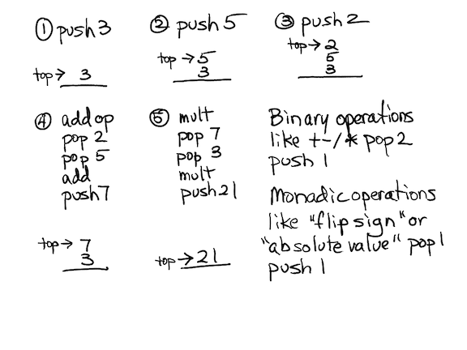

# RPN Calculator

## Overview

[Reverse Polish Notation](https://en.wikipedia.org/wiki/Reverse_Polish_notation) is a way of building very 
powerful calculators which never need the use of parentheses. They employ a notation called *postfix* where
operands are stated in a particular order followed by operators.

You are accustomed to *infix* notation.

For example, infix notation requires the use of parentheses to override the precedence of operations:

```
(5 + 2) * 3
(7) * 3
21
```

The addition operator has a lower precedence than the multiplication operator. To get it to execute first, the multiplication must be overriden by the parentheses.

In RPN the same calculation would be done this way:

```
3 5 2 +
3 7 *
21
```

Think of the operands as being pushed on the back of a stack. Arithmetic operations always pop something off the stack, perform a calculation and push the result onto the stack. Here's what the above calculation would look like:



## Pedagogical goals

You will be using or learning to use

* function pointers
* new members of ```vector``` to emulate a ```stack```
* stacks
* ```enum```
* ```try``` and ```catch``` for a specific ```exception```
* exceptions

# ```<stack>```

There is a stack template provided to you in the *STL*. You have used the STL before, that's there you get ```vector``` from. The stack template exposes methods including these:

```
top()
empty()
size()
push()
pop()
```

But alas, the stack template does *not* provide a means for looking beneath the top of the stack. In this project you need to print the contents of the entire stack before prompting the user for input. Therefore we will use our friend ```vector```.

You are accustomed to using ```push_back()```. Would it surprise you to learn there was also a ```pop_back()```? There are also methods ```front()``` and ```back()```. In particular, we can use ```pop_back()``` to serve as ```pop()``` and ```back()``` to server as ```top()```.

Assuming you have:

```c++
vector<float> s;
```

the above calculation can be performed using these steps:

```c++
float a, b, c;
// Load operands
s.push_back(3);
s.push_back(5);
s.push_back(2);
// Perform addition and push the result
a = s.back();
s.pop_back();
b = s.back();
s.pop_back();
c = b + a;
s.push_back(c);
// Perform the multiplication and push the result
a = s.back();
s.pop_back();
b = s.back();
s.pop_back();
c = b * a;
s.push_back(c);
```

Notice that both multiplication and addition are binary operations and seem to *work* the same way.

# Function pointers

## Motivation for function pointers

You might implement multiplication and addition like so:

```c++
float multiply(float a, float b) {
	return a * b;
}

float add(float a, float b) {
	return a + b;
}
```

Notice that these two functions:
* return the same type 
* have the same number of parameters
* the parameters have the same types in the same order

They are kind of interchangeable, right?

It would suck if we had to write code like this:

```c++
float a, b, c;
a = s.back();
s.pop_back();
b = s.back();
s.pop_back();
if (operation == ADDITION) {
	c = add(a, b);
} else if (operation == MULTIPLICATION) {
	c = multiply(a, b);
}
s.push_back(c);
```

After all, we might have dozens of operators making a rediculously long chain of ```if / else if```!

## Getting a pointer to a function

This is anticlimatic. Simply mentioning a function's name is using a pointer to the function. *Again, the name of a function is its own pointer.*

## Declaring a function pointer

If you have:

```c++
float add(float a, float b) {
	return b + a;
}
```

the pointer to this function, in english, is:

```
a pointer to a function that returns a float and takes two float arguments
```

In C and C++ this is written:

```c++
float (* func_ptr)(float, float);
```

Parse this just like the english above. The function we hope to point to returns a ```float```. It takes two ```float``` arguments. The name of the function pointer variable will be ```func_ptr```.

## Using a function pointer

We can now assign a pointer to any function that returns a ```float``` and takes two ```float``` arguments to the variable ```func_ptr```:

```c++
func_ptr = add;
```

After executing the above, the following two statements are identical.

```c++
c = add(4, 5);
c = func_ptr(4, 5);
```

# Your data structs

## The stack

You will create a ```vector``` of floats and use the ```vector``` like a stack. Only floats go on the stack, operators will be acted upon immediately.

## Operators

You will also create a ```vector``` of a user defined ```class``` or ```struct```. In this case, it does not matter which you use.

Here is the code:

```c++
class Operation {

public:

        Operation(string s, float (* f)(float a, float b)) {
                kind = BINARY;
                symbol = s;
                binary_func = f;
        }

        Operation(string s, float (* f)(float a)) {
                kind = MONADIC;
                symbol = s;
                monadic_func = f;
        }

        Operation(string s, void (* f)(vector<float> & s)) {
                kind = SPECIAL;
                symbol = s;
                special_func = f;
        }

        OpKind kind;
        string symbol;
        float (* binary_func)(float a, float b);
        float (* monadic_func)(float a);
        void (* special_func)(vector<float> & s);
};
```

Notice there are three constructors. They differ in arguments so the compiler can easily do the right thing. 
```BINARY```, ```MONADIC``` and ```SPECIAL``` are ```enums```. If you have not already learned about ```enums``` (actually ```enum```) then use the book or consult an Oracle. Obviously, this code is expecting the ```enum``` type to be called ```OpKind```.

Next comes the ```vector``` of these things:

```c++
// Remember that operator is a keyword. Don't use it. You can
// name this vector anything that makes sense to you and is in
// good style.
vector<Operation> operators;
```

You will want to initialize the vector. For example:

```c++
// Watch out for naming clashes - for example "negative" clashes with
// the standard math library.
operators.push_back(Operation("+", add));
```

Notice that ```symbol``` is defined as a ```string```. This means you can have multiple character operators. Such as:

```c++
// Notice square_root is not sqrt - that would clash.
operations.push_back(Operation("sqrt", square_root));
```

# Special operators

The ```SPECIAL``` operators are completely up to you. You're going to pass them a reference (which by the way is a specially constructed pointer) to your stack. What you do with the stack is up to you.

Here is one example (I expect you to comment like this to avoid demerits):

```c++
/* fswap() - this operator reverses the order of the topmost two numbers on
   the stack. It is a SPECIAL operator. As such, it must do its own underflow
   checking - underflow checking is done for MONADIC and BINARY operators in
   the general purpose code that calls them.

   Parameters:
   
   	vector<float> &		This is a reference to the stack of operands.
	I must be very careful not to mess this up.
	
    Returns:
    
    	none
*/

void fswap(vector<float> & s) {
        if (s.size() < 2)
                cout << "underflow" << endl;
        else {
                float a = s.back();
                s.pop_back();
                float b = s.back();
                s.pop_back();
                s.push_back(a);
                s.push_back(b);
        }
}
```

# Supported operators

You have to support the following (I will be adding to this list but I will tell you when I do):

```
* +
* -
* *
* /
* % 		**floating point mod operator**
* ~ 		**flip sign of top of stack**
* inv		**replaces top of stack with its inverse**
* pow		**raises top to the power of the second from top**
* pop		**remove topmost stack position**
* clear		**erase stack completely**
* round		**rounds up or down**
* trunc		**truncates to floor**
* sqrt		**square root**
* abs		**absolute value**
* rand		**push integer random number 0 to 65535 cast to float**
* rnd		**push float random number (0, 1)**
* rrnd		**push float random number between previous two stack values - top is max**
* log		**base 10 log**
* ln		**natural log**
* pi		**pushes a value of pi on the stack**
* aln		**replace top stack value with e^top stack value**
* e		**pushes the value of e onto the stack**
* quit		**exits the program**
```

Some math operations can result in ```nan```. For example, taking the square root of a negative number. For monadic and binary operations, use ```isnan()``` to test the result befor pushing it on the stack.

# Examples

This shows 3 divided by 6. As each number is added, the full stack is printed prior to the prompt.

```
RPN> 
6
6 RPN> 
3
6 3 RPN> 
/
0.5 RPN>
quit
```

Here is the original example of (5 + 2) * 3.

```
RPN> 
3
3 RPN>
5
3 5 RPN> 
2
3 5 2 RPN> 
+
3 7 RPN> 
*
21 RPN> 
quit
```

Here is the area of a circle with radius of 3.

```
RPN> 
pi
3.14159 RPN> 
3
3.14159 3 RPN> 
3
3.14159 3 3 RPN> 
*
3.14159 9 RPN> 
*
28.2743 RPN> 
quit
```

Here is an error condition producing ```nan```. I attempted to take the square root of -100. This produces ```nan``` which is discarded.

```
RPN> 
100
100 RPN> 
~
-100 RPN> 
sqrt
NaN (discarded)
RPN> 
quit
```

# What to hand in

**Make sure the only thing you hand in is one .cpp source code file.**

# Tests

## How to use the supplied test files

You should test your program by hand, one operation at a time. When you have implemented several, you can try *redirecting the input of your program from the command line*.

### Directions for the Mac

Follow [this](https://vimeo.com/259801503) video.

### Directions for Windows

Follow [this](https://vimeo.com/259803352) video.

## Test 1

Given [test1.txt](./test1.txt):

```
2
3
10
15
9
+
-
*
/
pop
quit
```

You must produce (input removed to be like how it will look if input is redirected from the above file):

```
RPN> 
2 RPN>
2 3 RPN> 
2 3 10 RPN> 
2 3 10 15 RPN>
2 3 10 15 9 RPN>
2 3 10 24 RPN>
2 3 14 RPN>
2 42 RPN>
21 RPN>
RPN>
```

## Test 2

Given [test2.txt](./test2.txt):

```
23.8
3
%
~
inv
4
pow
quit
```

You must produce (input removed to be like how it will look if input is redirected from the above file):

```
RPN>
23.8 RPN>
23.8 3 RPN>
2.8 RPN>
-2.8 RPN>
-0.357143 RPN>
-0.357143 4 RPN>
0.609507 RPN>
1 RPN>
```


## Test 3

Given [test3.txt](./test3.txt):

```
-3
sqrt
10
*
clear
-3
abs
pop
quit
```

You must produce (input removed to be like how it will look if input is redirected from the above file):

```
RPN> 
-3 RPN> 
NaN (discarded)
RPN> 
10 RPN> 
underflow
10 RPN> 
RPN> 
-3 RPN> 
3 RPN> 
RPN> 
```


## Test 4

Given [test4.txt](./test4.txt):

```
rand
rnd
rnd
rnd
rand
clear
10
20
rrnd
quit
```

You must produce:
```
(this tests produces random numbers - the ranges and types will be checked)
```


