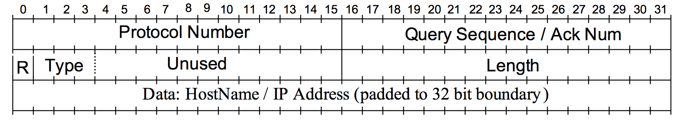

# Project 3 and Project 4 - Mock Domain Name Server

**SUPER IMPORTANT**

This is project 3 **and** 4. 

In project 3 you write only the client (use my server).

In project 4 you write only the server (use my client and your client).

Got it? This is an 18 day project broken into two 9 day subprojects - each of which will be graded on their own.

**MAKE YOUR REPO PRIVATE**

You have coded a UDP client server pair in project 1. In this project you will use what you have learned to create a simple approximation of a DNS Server. The **Domain Name System** turns the domain names you know and love into the IP addresses used by the Internet.

The hardest part of this project is probably getting all the casting and memory allocation right. 

Project 3 last the usual nine days to do the client (testing it against my server). You also have nine days to do Project 4 which is the server. You should test your server against my client and your own.

Remember network byte ordering issues. You should test on an Intel machine and on an ARM machine. Testing on one machine is not enough of a test to assure a properly working network application.

## Summary of server

Your server will respond to requests for translations of domain names to and from IP addresses. It will grow and maintain its own database of previously known information. The server may be asked to try extra hard to find a translation. It will do this by asking an oracle (a real Domain Name Server) for the information.

The server is required to be resilliant. It should not stop under any circumstances unless it is explicitly requested to do so by a client. The server must support any number of sequential clients.

## Summary of client

Your client will make one request of the server, process the server's response then exit. The client is instructed on what to do via command line options.

# Packet structure

The packets exchanged by client and server are depicted below:



* Protocol Identifier: (2 bytes) Set to the integer value 3600.

* Query Sequence/Ack Number: (2 bytes) The value of this sequence number is assigned by the client and is passed as a command line argument to the client program. On its response, the server increments it by one.

* Type: (3 bits) This indicates the type of the message.
  * 000 indicates IP address to hostname resolution request (sent by the client).
  * 001 indicates hostname to IP address resolution request (sent by the client).
  * 010 indicates IP address to hostname resolution response (sent by the server).
  * 011 indicates hostname to IP address resolution response (sent by the server).
  * 101 indicates that the server could not handle this request (sent by the server).
  * 110 indicates that the server should terminate. Note that unless the server receives this message, the server should not terminate. (sent by the client to the server). Note that it is only in this assignment that the clients can terminate the server. In the real DNS clients do not have this privilege. The server does not send a reply and the client should terminate immediately.

* R: (1 bit) This is reserved for future use and must be zero. It is ignored by both the client and the server.

* Unused: (12 bits) These bits are ignored by the client and the server.

* Length: (2 bytes) The length of the packet (in bytes) *including* the header sent by the client and the server.

  Thus far you've spent 8 bytes. This is the base size of a packet. Any payload is added to this length - this means you are using ```malloc``` to allocate a number of bytes you cannot know in advance (when sending text). The payload comes immediately after the base packet. There is a lot of casting here, or a little if you're smart. Either way:

> The owls are not what they seem.

* Data: (Variable length) Depending upon the packet type, this field can have an IP address (000, 011), hostname (001, 010) or IP address and port number (101).

  IP addresses are sent in IPv4 binary.

  Host names must be sent as null terminated C strings.

Type 101 packets are sent from the server to the client when the server doesn't know how to answer the client's request. In the real world, the DNS server will reply with the IP address for a higher level DNS server who knows more. It (the server your client is speaking with) will also supply the port number at which the higher level DNS server should be contacted. The IP address is sent in IPv4 binary. The port number is an unsigned short.

Note: The numbers such as protocol, sequence number, length, and port in the packet data must be network order. Type is buried in a short and is subject to the same rules. Text is not.

# Client

## Command line arguments

The following is the help option. Everything here with the exception of ```-v``` is to be supported by you:

```c++
case 'h':
	cerr << argv[0] << "options:" << endl;
	cerr << "	-h displays help" << endl;
	cerr << "	-d data associated with request" << endl;
	cerr << "	-n sequence number [0]" << endl;
	cerr << "	-p port_number ... [" << PORT_NUMBER << "]" <<endl;
	cerr << "	-r request type (0, 1, or 6)" << endl;
	cerr << "	-s server_address ... [" << SERVER_IP << "]" << endl;
	cerr << "	-v debug mode" << endl;
	exit(0);
```

```-v``` is optional and is for your use in debugging.

Except for ```-r 6```, the ```-d``` option is required.

Here are the definitions of the default values:

```c++
#pragma once

#define	PORT_NUMBER		53140
#define SERVER_IP		"127.0.0.1"
#define	TIMEOUT			1
#define	FAILNUM			0xC0A80001
#define	FAILPORT		6666
```

For types 0 and 1, you must print out clearly what is going on.

Here is output from my client showing all cases for types 0 and 1
```
p3 $> ./client -r 1 -d carthage.edu -n 100
Client attempting to connect to port: 53140
Client attempting to connect to ip:   127.0.0.1
Packet sent.
Client sequence number check - sent: 100 got back sequence number: 101
Search resolves to: 161.47.18.99
p3 $> ./client -r 0 -d 104.40.211.35 -n 100
Client attempting to connect to port: 53140
Client attempting to connect to ip:   127.0.0.1
Packet sent.
Client sequence number check - sent: 100 got back sequence number: 101
Search resolves to: microsoft.com
p3 $> ./client -r 0 -d FOO -n 100
Client attempting to connect to port: 53140
Client attempting to connect to ip:   127.0.0.1
Request data not a valid IPv4 address: FOO
p3 $> ./client -r 0 -d 104.40.211.1 -n 100
Client attempting to connect to port: 53140
Client attempting to connect to ip:   127.0.0.1
Packet sent.
Client sequence number check - sent: 100 got back sequence number: 101
Redirect to 192.168.0.1 at port 6666
p3 $>
```

No timeout is implemented in this program. Control-c the client if the server doesn't respond. IRL this would not happen.


## Error checking

What follows are C++ statements copied from my own implementation. These give you an idea what the things I check for. You better do the same.

For command 0x000, the data supplied the by ```-r``` command line option should be verified by the client to be in IPv4 dot format. If it isn't, do this:

|print statement|exit code|
|:------------- |:------- |
|```cout << "Request data not a valid IPv4 address" << endl;```|20|

A sequence number given by ```-n``` cannot exceed the maximum value of an unsigned short. See ```climits```. 

|print statement|exit code|
|:------------- |:------- |
|```cout << "Sequence number exceeds maximum value of: " << USHRT_MAX << endl;```|21|

```-r``` options should be checked:

|print statement|exit code|
|:------------- |:------- |
|cerr << "Packet type (-r) is not one of 0, 1 or 6" << endl;|3|;

Other errors you are expected to check for:

|print statement|exit code|
|:------------- |:------- |
|```perror("ERROR opening socket");```|1|
|```cout << "ERROR, no such host: " << server_address << endl;```|2|
|```cerr << "ERROR Number of bytes sent [" << bytes_sent << "] does not match message size [" << p->Length() << "]" << endl;```|5|
|```cout << "Client received a datagram smaller than RawPacket in size: " << bytes_received << endl;```|no exit|
|```cout << "Client received bad protocol number: " << p->protocol_number << endl;```|no exit|
|```cout << "Client sequence number check - sent: " << sequence_number << " got back sequence number: " << p->sequence_number << endl;```|no exit|
|```cout << "Client received bad type: " << type << " expected 2 or 3" << endl;```|no exit|

# Server

## Server command line arguments

```c+++

case 'h':
	cerr << argv[0] << "options:" << endl;
	cerr << "   -h displays help" << endl;
	cerr << "   -p port_number ... defaults to " << PORT_NUMBER << endl;
	cerr << "   -v verbose mode - prints the received payloads" << endl;
	exit(0);
```

## A nametable database

The server must load a database of somekind. IRL this would come from a mixture of database and self-discovery.

```
carthage.edu,161.47.18.99
microsoft.com,104.40.211.35
google.com,216.58.192.238
silhouettefx.com,66.221.90.7
elasticreality.com,184.168.221.96
```

## Error checking

|print statement|exit code|
|:------------- |:------- |
|cerr << "-n required to specify name table data" << endl;|2|
|cerr << "Name table file: " << name_table_file_name << " failed to load." << endl|3|
|perror("ERROR opening socket");|1|
|perror("ERROR on binding");|4|
|cout << "Server received a datagram smaller than RawPacket in size: " << bytes_received << endl;|no exit|
|cout << "Server received bad protocol number: " << p->protocol_number << endl;|
|cout << "Server sent wrong number of bytes on type 5. Sent: " << bytes_sent << " expected to send: " << bigp->Length() << endl;|no exit|
|"Server sent wrong number of bytes on type 2. Sent: " << bytes_sent << " expected to send: " << bigp->Length() << endl;|no exit|
|cout << "Server sent wrong number of bytes on type 3. Sent: " << bytes_sent << " expected to send: " << bigp->Length() << endl;|no exit|

# Inspiration for this project

This project based upon Suman Banerjee's version of this course.
