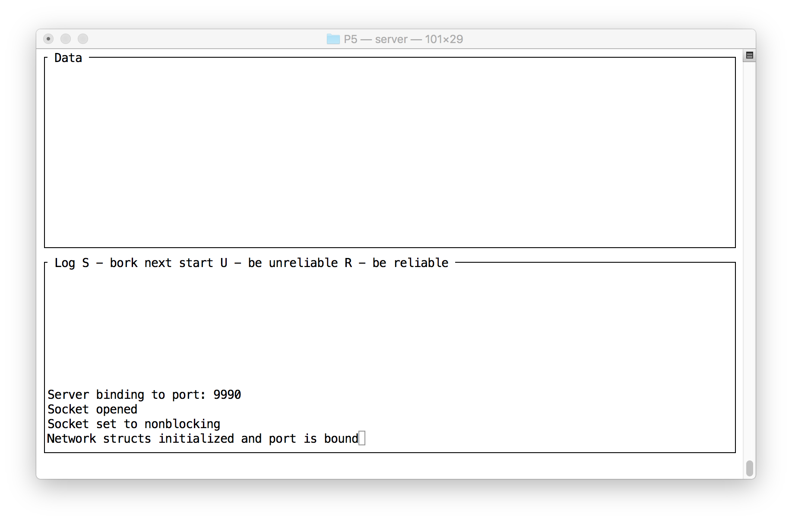
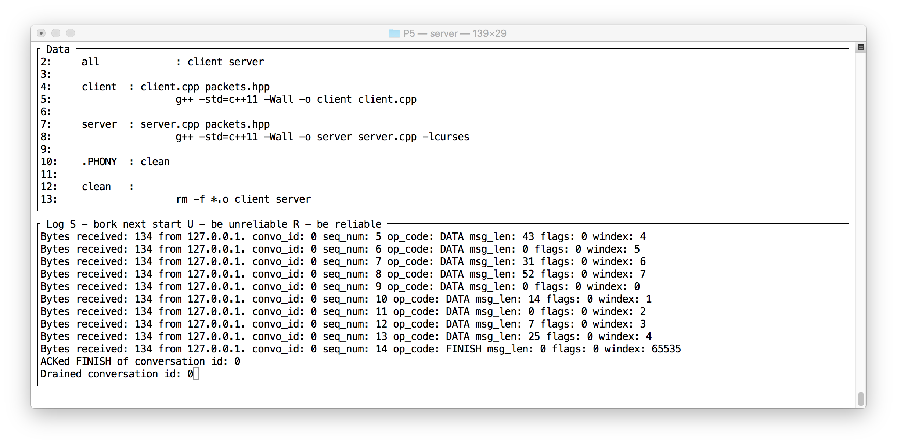
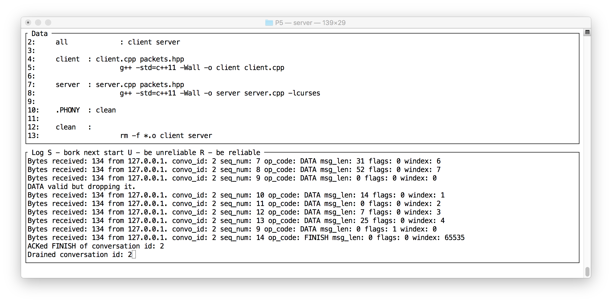

# Reliable from unreliable

In this project you can start from your UDP code. On top of sending / receiving UDP packets you will layer a protocol that moves towards reliability by doing bookkeeping, implementing timeouts, retransmissions and a sliding window algorithm.

*I will supply the server. You need only implement the client. This is **still** a lot of work so don't underestimate it.*

# Partnership Rules

We are using the following work rules:
- You may partner with whomever you choose.
- You may choose not to partner.
- You may work (share code) with one and only one person (your partner).
- You may organize help groups in any fashion you wish to discuss, draw pictures, research, etc.
- You may not use a projector to project code or otherwise share code outside of your partnership.
- Partners receive the same grade as each other.
- *Projects will be shifted to elearning as hand in projects.*
- Only one person in a partnership will submit code.
- Your code *must* indicate who your partner is at the top of your main source file.

# packets.hpp

Please see [packets.hpp](./packets.hpp) for full details of the structures and defines.

All the packets that the client sends and all it receives are the same size so a traditional struct can be used. Clients send CPacket and receive SPacket from the server.

Both CODE_BAD's are sentinels, not op codes. They tell you the bounds of the op code values. There is a way to do this with enums but I used defines.

## CPacket

Here is a CPacket - note this MAY be out of date.

```c++
struct CPacket {
	unsigned short convo_id;
	unsigned short seq_num;
	unsigned short op_code;
	unsigned short msg_len;
	unsigned short flags;
	unsigned short window_index;
	char msg[CP_BUFFER_SIZE];
};
```

All shorts should be in network byte order when they hit the wire.

Here are the client opcodes - note this may be out of date.

```c++
#define COP_CODE_NOOP   0
#define COP_CODE_START  1
#define COP_CODE_FINISH 2
#define COP_CODE_DATA   3
// NOT A REAL OP CODE ...
#define COP_CODE_BAD    4
```

Client Op Code | Meaning
-------------- | -------
COP_CODE_NOOP | Should never appear - notice its value is zero so this is a way to notice you haven't initialized the field.|
COP_CODE_START | Sent using stop-and-wait, all other fields should be zero except window_index. Window_index should be 0xFFFF signifying stop-and-wait. When you get a SOP_CODE_ACK, that packet's convo_id will be your client's convo_id for the duration.
COP_CODE_FINISH | Should be sent when your client is done. It is sent via stop-and-wait.
COP_CODE_DATA | Is sent in volleys using the sliding window. msg_len must be the number of non-null characters in the msg. window_index must be filled in with a value ranging from 0 to the size of the window minus 1.

flags starts out as zero. If this packet is resent due to loss / timeout, set the COP_FLAG_RESEND flag.

seq_num for all packets starts at zero. The server will echo back the same seq_num and convo_id.

## SPacket

Here is an SPacket - note this MAY be out of date.

```c++
struct SPacket {
	unsigned short convo_id;
	unsigned short seq_num;
	unsigned short op_code;
	unsigned short flags;
};
```

All shorts should be in network byte order when they hit the wire.

Here are the server opcodes - note this may be out of date.

```c++
#define SOP_CODE_NOOP   0
#define SOP_RESERVED    1
#define	SOP_CODE_ACK    2
#define	SOP_CODE_ERROR  3
// NOT A REAL OP CODE ...
#define SOP_CODE_BAD    4
```

Server Op Code | Meaning
-------------- | -------
SOP_CODE_NOOP | Should never appear - use it as a sign that you forgot to initialize something.
SOP_RESERVED | Should never appear - if it does, treat it as an error.
SOP_CODE_ACK | Something went well.
SOP_CODE_ERROR | Something did not go well.

The server dispenses convo_ids after receiving a COP_CODE_START. The server knows what convo_ids are in use and which are not.

The server SOP_CODE_ACKs every packet sent by the client. The SOP_CODE_ACK will have the same convo_id and seq_num.

flags will be zero unless the server has noticed the client sent it the same data more than once (i.e. it has already SOP_CODE_ACKed a packet with the same convo_id and seq_num. When it notices a duplicate, it will ACK again but set flags to 
SOP_FLAG_DUP.

## Other defines

Here are some other contents of packets.hpp. Note this may be out of date.

```c++
#define	PORT_NUMBER       9990

#define	SOP_FLAG_DUP      0x0001
#define COP_FLAG_RESEND   0x0001

#define CP_BUFFER_SIZE    122
#define CP_BUFFER_LIMIT   120
#define DEF_WINDOW_SIZE   8
#define	TIMEOUT_SECONDS   1
#define MAX_RETRIES       4
```

The default port number is PORT_NUMBER.

Client data buffers are CP_BUFFER_SIZE but should never hold more than CP_BUFFER_LIMIT actual bytes. The remaining two bytes should be preserved as null both for padding and null termination. Every line you read from a file (see later) should be clipped against CP_BUFFER_LIMIT.

Set your udp socket to timeout after TIMEOUT_SECONDS. Something like this: 

```
setsockopt(udp_socket, SOL_SOCKET, SO_RCVTIMEO, &tv,sizeof(tv))
```

No packet should be retransmitted more than MAX_RETRIES times. If this happens, say so clearly, cleanup (try sending a FINISH if it wasn't FINISH that failed, close files and sockets) and exit.

# Command line options

```
P5 $> ./client  -h
./clientoptions:
  -f filename (required)
  -h displays help
  -n window size ... defaults to 8
  -s server_address ... defaults to 127.0.0.1
  -p port_number ... defaults to 9990
P5 $> 
```

# Overall goal of your client

Send the file specified with the -f option to the server in a reliable way using an unreliable connection.

# The server

Here's a fresh server:



Make sure your window is pretty wide. Here I have sent a short file:



The server has a few commands:

Key | Meaning
--- | -------
S | The next START received will get dropped.
U | Five percent of received - good - packets will be dropped.
R | Turns off U
q | Not shown - exits normally.

The server tries to be as informative as possible.

**Pay extra attention to this next picture:**



There is a lot here:

* Notice ```DATA valid but dropping it.``` The U key is active.
* The seq_num dropped was 9.
* Notice ```Bytes received: 134 from 127.0.0.1. convo_id: 2 seq_num: 9 op_code: DATA msg_len: 0 flags: 1 windex: 0``` way down the list of sent packets. This is the retransmission. Notice the seq_num is 9 and flags are non-zero.
* Notice that the server **still** listed line 9 in the proper order. The server implements this part of sliding window on its end.

# The spec is probably incomplete

This has been a very large undertaking and my hands hurt. Ask questions and check for updates frequently.

